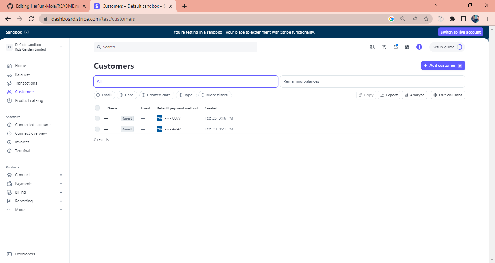
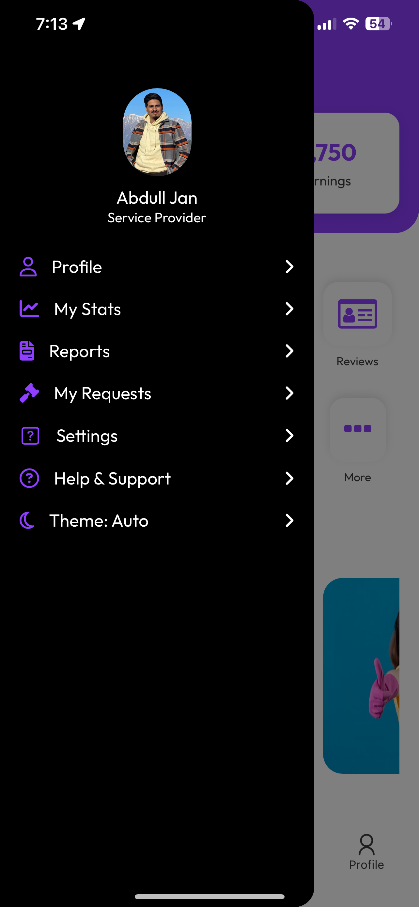

# 📱 HarFun Mola – Smart Home Services App

Welcome to **HarFun Mola** – a comprehensive, full-stack mobile + web application ecosystem that connects **users** with **trusted service providers** for all home repair, diagnostics, and booking needs. From booking an electrician to getting your blender diagnosed, HarFun Mola ensures a **secure, transparent, and delightful** experience for everyone.

---

## 🌟 Project Highlights

- 📱 **User Mobile App** (React Native / Flutter)
- 🔧 **Service Provider Mobile App**
- 🖥️ **Admin Web Dashboard** (React + Node/Express)
- 🔐 **Secure Auth & Payment with Escrow System**
- 🔄 **Real-time Order Tracking, Bidding, and Chat**

---

## 🛫 The Journey Begins: User Registration

We begin with a clean, minimal registration experience for users. Every detail you enter is encrypted and protected.

✅ Email verification  
✅ Password recovery  
✅ Profile editing  
✅ Feedback system

  
  &nbsp;&nbsp;
  
  &nbsp;&nbsp;
  

  <em>1). Starter Screen</em>
  &nbsp;&nbsp;&nbsp;&nbsp;&nbsp;&nbsp;&nbsp;&nbsp;
  <em>2). Login</em>
  &nbsp;&nbsp;&nbsp;&nbsp;&nbsp;&nbsp;&nbsp;&nbsp;
  <em>3). Role-based Sign Up</em>

  
  &nbsp;&nbsp;
  
  &nbsp;&nbsp;
  

  <em>4). Provider Details</em>
  &nbsp;&nbsp;&nbsp;&nbsp;&nbsp;&nbsp;&nbsp;&nbsp;
  <em>5). Background Check</em>
  &nbsp;&nbsp;&nbsp;&nbsp;&nbsp;&nbsp;&nbsp;&nbsp;
  <em>6). Email Verification</em>

---

## 🧰 Discovering Services

Users are shown categorized **major home services** and **minor product diagnostics** like microwave repair.

📌 Categorized Services  
📌 Service Descriptions  
📌 Real-Time Availability  
📌 Booking with Instant Confirmation

  
  &nbsp;&nbsp;
  
  &nbsp;&nbsp;
  

  <em>1). Major Categories</em>
  &nbsp;&nbsp;&nbsp;&nbsp;&nbsp;&nbsp;&nbsp;&nbsp;
  <em>2). Service Listings</em>
  &nbsp;&nbsp;&nbsp;&nbsp;&nbsp;&nbsp;&nbsp;&nbsp;
  <em>3). List Details</em>

  
  &nbsp;&nbsp;
  
  &nbsp;&nbsp;
  

  <em>4). Booking Screen</em>
  &nbsp;&nbsp;&nbsp;&nbsp;&nbsp;&nbsp;&nbsp;&nbsp;
  <em>5). Real-time Location Suggestions</em>
  &nbsp;&nbsp;&nbsp;&nbsp;&nbsp;&nbsp;&nbsp;&nbsp;
  <em>6). Stripe Card Payment</em>

---

## 🔎 Minor Repairs with Diagnostic Support

Not sure what’s wrong with your appliance? Use **Diagnostic Mode**:

- Predefined diagnostic fee  
- Real-time repair cost updates  
- Accept or cancel post-diagnostic  
- Transparent pricing

  
  &nbsp;&nbsp;
  
  &nbsp;&nbsp;
  

  <em>1). Minor Categories</em>
  &nbsp;&nbsp;&nbsp;&nbsp;&nbsp;&nbsp;&nbsp;&nbsp;
  <em>2). Minor Service Listings</em>
  &nbsp;&nbsp;&nbsp;&nbsp;&nbsp;&nbsp;&nbsp;&nbsp;
  <em>3). Select the Specific Issue</em>

  
  &nbsp;&nbsp;
  
  &nbsp;&nbsp;
  

  <em>4). Listings Under Specific Issue</em>
  &nbsp;&nbsp;&nbsp;&nbsp;&nbsp;&nbsp;&nbsp;&nbsp;
  <em>5). View Provider's Profile & Ratings</em>
  &nbsp;&nbsp;&nbsp;&nbsp;&nbsp;&nbsp;&nbsp;&nbsp;
  <em>6). Select Diagnose if Not Sure</em>

---

## 💰 Payments with Escrow System

We ensure **fairness** with a secure escrow system:

- 🏦 Payments held until job completion  
- 💼 Wallet system for service providers  
- 💸 Multiple payment methods (COD, JazzCash, EasyPaisa)  
- 📊 Auto deduction of platform fee

  
  &nbsp;&nbsp;
  

  <em>1). Stripe Dashboard Overview</em>
  &nbsp;&nbsp;&nbsp;&nbsp;&nbsp;&nbsp;&nbsp;&nbsp;
  <em>2). Total Number of Transactions</em>

  
  &nbsp;&nbsp;
  

  <em>3).Total App Customers</em>
  &nbsp;&nbsp;&nbsp;&nbsp;&nbsp;&nbsp;&nbsp;&nbsp;
  <em>4). Total App Servive Providers</em>

---

## 🤝 Bidding Marketplace

Don’t want fixed-price? Let the providers **bid** on your job!

1. User lists a request  
2. Service providers send bids  
3. User negotiates in chat  
4. Agreement forms a contract  
5. Ratings exchanged afterward

  
  &nbsp;&nbsp;
  
  &nbsp;&nbsp;
  

  <em>1). Latest Jobs Posted By Users</em>
  &nbsp;&nbsp;&nbsp;&nbsp;&nbsp;&nbsp;&nbsp;&nbsp;
  <em>2). Bid to your desired job</em>
  &nbsp;&nbsp;&nbsp;&nbsp;&nbsp;&nbsp;&nbsp;&nbsp;
  <em>3). On-Going Jobs of Providers</em>

  
  &nbsp;&nbsp;
  
  &nbsp;&nbsp;
  

  <em>1). Total Proposals Get</em>
  &nbsp;&nbsp;&nbsp;&nbsp;&nbsp;&nbsp;&nbsp;&nbsp;
  <em>2). Chat with User to get Hired</em>
  &nbsp;&nbsp;&nbsp;&nbsp;&nbsp;&nbsp;&nbsp;&nbsp;
  <em>3). Real-Time Chat</em>

---

## 📦 Order Management

Keep every order in check, from start to finish:

- Unique Order IDs  
- Real-time provider location tracking  
- Chat and notifications  
- Status stages: Pending → In Progress → Completed

  
  &nbsp;&nbsp;
  
  &nbsp;&nbsp;
  

  <em>1). Accept/Decline the Booking</em>
  &nbsp;&nbsp;&nbsp;&nbsp;&nbsp;&nbsp;&nbsp;&nbsp;
  <em>2). Start the Service</em>
  &nbsp;&nbsp;&nbsp;&nbsp;&nbsp;&nbsp;&nbsp;&nbsp;
  <em> 3).View Location/Complete Service</em>

  
  &nbsp;&nbsp;
  
  &nbsp;&nbsp;
  

  <em>1). User's Live Location</em>
  &nbsp;&nbsp;&nbsp;&nbsp;&nbsp;&nbsp;&nbsp;&nbsp;
  <em>2). Rate user after completion</em>
  &nbsp;&nbsp;&nbsp;&nbsp;&nbsp;&nbsp;&nbsp;&nbsp;
  <em>3). Service Completion Alert</em>

---

## 🧑‍🔧 AssistiveFix Navigator

Say hello to **AssistiveFix** — your **AI-powered guide** for diagnosing problems and getting the right help fast. It's like having a technician in your pocket!

- 💬 Conversational interface for smart diagnostics  
- 📝 Dynamic checklist generation by product type  
- 🛠️ Service suggestions based on symptoms  
- 🌍 Multilingual support for broader accessibility  
- 🔄 Self-learning for smarter diagnostics over time  
- 🚀 Quick, friendly, and deeply helpful UX

  <em>Chat Flow With AssistiveFix Navigator</em>
  &nbsp;&nbsp;&nbsp;&nbsp;&nbsp;&nbsp;&nbsp;&nbsp;

  
  &nbsp;&nbsp;
  
    &nbsp;&nbsp;
   
  &nbsp;&nbsp;
  

---

## 🧠 IntelliServe Insights

**IntelliServe Insights** takes your service experience to the next level by offering **personalized, intelligent recommendations** tailored to your needs, history, and context.

- 🧲 Smart Suggestions based on past bookings  
- 📍 Location-aware service matching (within 5km radius)
- 🌟 Provider selection based on top reviews, previous user ratings, and booking history

  <em>   Recommended Services</em>
  &nbsp;&nbsp;&nbsp;&nbsp;&nbsp;&nbsp;&nbsp;&nbsp;

  

---

## 👨‍🔧 Service Provider App

Empowering providers with tools to grow:

- Profile creation & verification  
- Real-time dashboard  
- Bidding panel  
- Wallet management  
- Task tracker  
- Client communication

  
  &nbsp;&nbsp;
  
  &nbsp;&nbsp;
  

  <em>1). Service Provider Dashboard</em>
  &nbsp;&nbsp;&nbsp;&nbsp;&nbsp;&nbsp;&nbsp;&nbsp;
  <em>2). More Options on Dashboard</em>
  &nbsp;&nbsp;&nbsp;&nbsp;&nbsp;&nbsp;&nbsp;&nbsp;
  <em> 3). Post Listings through dashboard</em>

---

## 🧑‍💻 Admin Web Panel

Behind the scenes, admins keep everything clean and running:

- User & provider management  
- Approvals & verifications  
- Escrow & financial tracking  
- Community moderation  
- Announcement & notification system

  
   
  <em>Admin dashboard: user/provider/task overview</em>

  
   
  <em>Transaction management and reporting</em>

---

## 🔐 Tech Stack

| Platform | Tech |
|----------|------|
| **Frontend (Mobile)** | React Native / Flutter |
| **Backend** | Node.js, Express.js |
| **Database** | MongoDB |
| **Real-Time** | Socket.io |
| **Authentication** | JWT + Email OTP |
| **Payments** | Custom Wallet + Escrow Logic |
| **Admin Panel** | React + Tailwind |
| **Storage** | Cloudinary for images |

---

## 📂 Folder Structure

