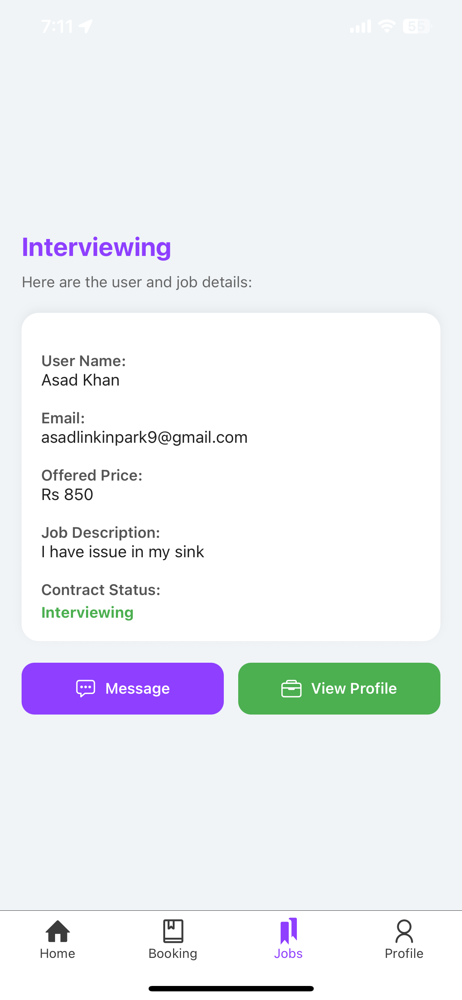

# 📱 HarFun Mola – Smart Home Services App

Welcome to **HarFun Mola** – a comprehensive, full-stack mobile + web application ecosystem that connects **users** with **trusted service providers** for all home repair, diagnostics, and booking needs. From booking an electrician to getting your blender diagnosed, HarFun Mola ensures a **secure, transparent, and delightful** experience for everyone.

---

## Project Highlights

- 📱 **User Mobile App** (React Native)
- 🔧 **Service Provider Mobile App**
- 🖥️ **Admin Web Dashboard** (React + Node/Express)
- 🔐 **Secure Auth, Wallet & Escrow Payment System**
- 🔄 **Real-Time Booking, Order Tracking, Bidding, and Chat**
- 🤖 **AssistiveFix Navigator** (AI Diagnostic Assistant)
- 🧠 **IntelliServe Insights** (Smart Recommendations)

---

## 🛫 The Journey Begins: User Registration

We begin with a clean, minimal registration experience for users. Every detail you enter is encrypted and protected.

✅ Email verification  
✅ Password recovery  
✅ Profile editing  
✅ Feedback system

<table align="center">
  <tr>
    <td align="center"></td>
    <td align="center"></td>
    <td align="center"></td>
  </tr>
  <tr>
    <td align="center"><em>1). Starter Screen</em></td>
    <td align="center"><em>2). Login</em></td>
    <td align="center"><em>3). Role-based Sign Up</em></td>
  </tr>
  <tr>
    <td align="center"></td>
    <td align="center"></td>
    <td align="center"></td>
  </tr>
  <tr>
    <td align="center"><em>4). Provider Details</em></td>
    <td align="center"><em>5). Background Check</em></td>
    <td align="center"><em>6). Email Verification</em></td>
  </tr>
</table>

---

## 🧰 Discovering Services

Users are shown categorized **major home services** and **minor product diagnostics** like microwave repair.

📌 Categorized Services  
📌 Service Descriptions  
📌 Real-Time Availability  
📌 Booking with Instant Confirmation

<table align="center" cellspacing="0" cellpadding="0">
  <tr>
    <td align="center"></td>
    <td align="center"></td>
    <td align="center"></td>
  </tr>
  <tr>
    <td align="center"><em>1). Major Categories</em></td>
    <td align="center"><em>2). Service Listings</em></td>
    <td align="center"><em>3). List Details</em></td>
  </tr>
  <tr>
    <td align="center"></td>
    <td align="center"></td>
    <td align="center"></td>
  </tr>
  <tr>
    <td align="center"><em>4). Booking Screen</em></td>
    <td align="center"><em>5). Real-time Location Suggestions</em></td>
    <td align="center"><em>6). Stripe Card Payment</em></td>
  </tr>
</table>

---

## 🔎 Minor Repairs with Diagnostic Support

Not sure what’s wrong with your appliance? Use **Diagnostic Mode**:

- Predefined diagnostic fee  
- Real-time repair cost updates  
- Accept or cancel post-diagnostic  
- Transparent pricing

<table align="center" cellspacing="0" cellpadding="0">
  <tr>
    <td align="center"></td>
    <td align="center"></td>
    <td align="center"></td>
  </tr>
  <tr>
    <td align="center"><em>1). Minor Categories</em></td>
    <td align="center"><em>2). Minor Service Listings</em></td>
    <td align="center"><em>3). Select the Specific Issue</em></td>
  </tr>
  <tr>
    <td align="center"></td>
    <td align="center"></td>
    <td align="center"></td>
  </tr>
  <tr>
    <td align="center"><em>4). Listings Under Specific Issue</em></td>
    <td align="center"><em>5). View Provider's Profile & Ratings</em></td>
    <td align="center"><em>6). Select Diagnose if Not Sure</em></td>
  </tr>
</table>

---

## 💰 Payments with Escrow System

We ensure **fairness** with a secure escrow system:

- 🏦 Payments held until job completion  
- 💼 Wallet system for service providers  
- 💸 Multiple payment methods (COD, JazzCash, EasyPaisa)  
- 📊 Auto deduction of platform fee

<table align="center" cellspacing="0" cellpadding="0">
  <tr>
    <td align="center"></td>
    <td align="center"></td>
  </tr>
  <tr>
    <td align="center"><em>1). Stripe Dashboard Overview</em></td>
    <td align="center"><em>2). Total Number of Transactions</em></td>
  </tr>
  <tr>
    <td align="center"></td>
    <td align="center"></td>
  </tr>
  <tr>
    <td align="center"><em>3). Total App Customers</em></td>
    <td align="center"><em>4). Total App Service Providers</em></td>
  </tr>
</table>

---

## 🤝 Bidding Marketplace

Don’t want fixed-price? Let the providers **bid** on your job!

1. User lists a request  
2. Service providers send bids  
3. User negotiates in chat  
4. Agreement forms a contract  
5. Ratings exchanged afterward

<table align="center" cellspacing="0" cellpadding="0">
  <tr>
    <td align="center"></td>
    <td align="center"></td>
    <td align="center"></td>
  </tr>
  <tr>
    <td align="center"><em>1). Latest Jobs Posted By Users</em></td>
    <td align="center"><em>2). Bid to your desired job</em></td>
    <td align="center"><em>3). On-Going Jobs of Providers</em></td>
  </tr>
  <tr>
    <td align="center"></td>
    <td align="center"></td>
    <td align="center"></td>
  </tr>
  <tr>
    <td align="center"><em>4). Total Proposals Get</em></td>
    <td align="center"><em>5). Chat with User to get Hired</em></td>
    <td align="center"><em>6). Real-Time Chat</em></td>
  </tr>
</table>

---

## 📦 Order Management

Keep every order in check, from start to finish:

- Unique Order IDs  
- Real-time provider location tracking  
- Chat and notifications  
- Status stages: Pending → In Progress → Completed

<table align="center" cellspacing="0" cellpadding="0">
  <tr>
    <td align="center"></td>
    <td align="center"></td>
    <td align="center"></td>
  </tr>
  <tr>
    <td align="center"><em>1). Accept/Decline the Booking</em></td>
    <td align="center"><em>2). Start the Service</em></td>
    <td align="center"><em>3). View Location/Complete Service</em></td>
  </tr>
  <tr>
    <td align="center"></td>
    <td align="center"></td>
    <td align="center"></td>
  </tr>
  <tr>
    <td align="center"><em>4). User's Live Location</em></td>
    <td align="center"><em>5). Rate user after completion</em></td>
    <td align="center"><em>6). Service Completion Alert</em></td>
  </tr>
</table>

---

## 🧑‍🔧 AssistiveFix Navigator

Say hello to **AssistiveFix** — your **AI-powered guide** for diagnosing problems and getting the right help fast. It's like having a technician in your pocket!

- 💬 Conversational interface for smart diagnostics  
- 📝 Dynamic checklist generation by product type  
- 🛠️ Service suggestions based on symptoms  
- 🌍 Multilingual support for broader accessibility  
- 🔄 Self-learning for smarter diagnostics over time  
- 🚀 Quick, friendly, and deeply helpful UX

<table align="center">
  <tr>
    <td colspan="4" align="center"><em>Chat Flow With AssistiveFix Navigator</em></td>
  </tr>
  <tr>
    <td align="center"></td>
    <td align="center"></td>
    <td align="center"></td>
    <td align="center"></td>
  </tr>
</table>

---

## 🧠 IntelliServe Insights

**IntelliServe Insights** takes your service experience to the next level by offering **personalized, intelligent recommendations** tailored to your needs, history, and context.

- 🧲 Smart Suggestions based on past bookings  
- 📍 Location-aware service matching (within 5km radius)
- 🌟 Provider selection based on top reviews, previous user ratings, and booking history

<table align="center">
  <tr>
    <td align="center" style="background-color: #f6f8fa;">
      <em>Recommended Services</em>
    </td>
  </tr>
  <tr>
    <td align="center">
      
    </td>
  </tr>
</table>

---

## 👨‍🔧 Service Provider App

Empowering providers with tools to grow:

- Profile creation & verification  
- Real-time dashboard  
- Bidding panel  
- Wallet management  
- Task tracker  
- Client communication

<table align="center">
  <tr>
    <td align="center"></td>
    <td align="center"></td>
    <td align="center"></td>
  </tr>
  <tr>
    <td align="center"><em>1). Service Provider Dashboard</em></td>
    <td align="center"><em>2). More Options on Dashboard</em></td>
    <td align="center"><em>3). Post Listings through Dashboard</em></td>
  </tr>
</table>

---

## 🧑‍💻 Admin Web Panel

Behind the scenes, admins keep everything clean and running:

- User & provider management  
- Approvals & verifications  
- Escrow & financial tracking  
- Community moderation  
- Announcement & notification system

<table align="center">
  <tr>
    <td align="center"></td>
    <td align="center"></td>
  </tr>
  <tr>
    <td colspan="2" align="center"><em>Admin Panel Dashboard ☝</em></td>
  </tr>

  <tr>
    <td align="center"></td>
    <td align="center"></td>
  </tr>
  <tr>
    <td colspan="2" align="center"><em>Add Users & Service Provider Directly Through Dashboard ☝</em></td>
  </tr>

  <tr>
    <td align="center"></td>
    <td align="center"></td>
  </tr>
  <tr>
    <td colspan="2" align="center"><em>Manage Categories & Listings - Including Soft Disable (Ban) Listings ☝</em></td>
  </tr>

  <tr>
    <td align="center"></td>
    <td align="center"></td>
  </tr>
  <tr>
    <td colspan="2" align="center"><em>Manage Booking & Payments Including Disputes ☝</em></td>
  </tr>

  <tr>
    <td colspan="2" align="center"></td>
  </tr>
  <tr>
    <td colspan="2" align="center"><em>Add Multiple Admins ☝</em></td>
  </tr>
</table>

---

<h2 align="center">🔐 Tech Stack</h2>

<table>
  <tr>
    <th>Category</th>
    <th>Technology Used</th>
  </tr>
  <tr>
    <td><strong>Frontend (Mobile)</strong></td>
    <td>
      
    </td>
  </tr>
  <tr>
    <td><strong>Backend</strong></td>
    <td>
      
      
    </td>
  </tr>
  <tr>
    <td><strong>Database</strong></td>
    <td>
      
      
    </td>
  </tr>
  <tr>
    <td><strong>Authentication</strong></td>
    <td>
      
      
    </td>
  </tr>
  <tr>
    <td><strong>Payments</strong></td>
    <td>
      
    </td>
  </tr>
  <tr>
    <td><strong>Real-Time Updates</strong></td>
    <td>
      
    </td>
  </tr>
  <tr>
    <td><strong>AI & Recommendations</strong></td>
    <td>
      
    </td>
  </tr>
  <tr>
    <td><strong>API Architecture</strong></td>
    <td>
      
    </td>
  </tr>
  <tr>
    <td><strong>Maps & Location Services</strong></td>
    <td>
      
    </td>
  </tr>
  <tr>
    <td><strong>Admin Panel</strong></td>
    <td>
      
      
    </td>
  </tr>
  <tr>
    <td><strong>Storage</strong></td>
    <td>
      
    </td>
  </tr>
  <tr>
    <td><strong>Infrastructure</strong></td>
    <td>
      
    </td>
  </tr>
</table>

---

## 🙌 Thanks for Reading!

Thank you for taking the time to explore my Final Year Project – **HarFun Mola**.  
This project represents months of learning, building, and debugging .  
I hope it gives a clear overview of the system’s features, structure, and tech stack 💡.

If you have any feedback, suggestions, or questions, feel free to reach out! 😊
